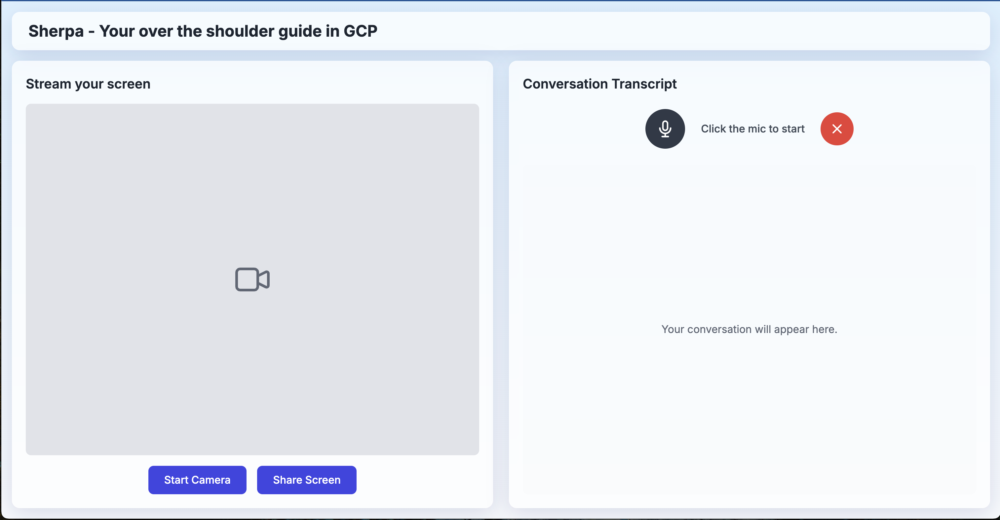

# Sherpa - Your Over-the-Shoulder AI Guide in GCP 🏔️

---

## Project Overview 🚀

Sherpa is an **AI-powered assistant** designed to revolutionize how developers, partners, and new hires interact with Google Cloud Platform (GCP). By leveraging the real-time, multimodal capabilities of **Gemini Live** and the **Agent Development Kit (ADK)**, Sherpa acts as an "over-the-shoulder" expert. It understands user speech and on-screen activity (like code in an IDE or the GCP Console) to provide interactive, conversational guidance. Our primary goal is to significantly reduce complexity, accelerate development and deployment cycles, and streamline onboarding as well as migrations onto GCP.



---

## Project Structure 📁

The project is organized into two main components:

* **`client/`**: This folder contains the frontend components, including the `index.html` file and its corresponding JavaScript file, which handle the user interface and interactions.
* **`server/`**: This folder houses the backend logic, specifically the Python code `multimodal_server_adk.py`, responsible for launching the WebSocket server that powers Sherpa's AI capabilities.

---

## Getting Started ⚡

Follow these steps to set up and run Sherpa:

### 1. Set Your Google API Key 🔑

Before running the application, you need to set your Google API Key as an environment variable. Obtain your API key from AI Studio.

```bash
export GOOGLE_API_KEY="Your Api Key"
```

### 2. Run the Servers ▶️

Execute the provided shell script to start the server components:

```bash
./start_servers.sh
```

### 3. Launch Sherpa in Your Browser 🌐

Once the servers are running, open the index.html file located in the client/ folder in your web browser. 
VOILA! You can now start communicating with Sherpa and experience your AI guide in GCP.

---

## Technologies Used 🛠️

Gemini Live: For real-time, multimodal AI capabilities.

Agent Development Kit (ADK): Framework for building intelligent agents.

Python: For the backend WebSocket server.

HTML/JavaScript: For the frontend client interface.

---